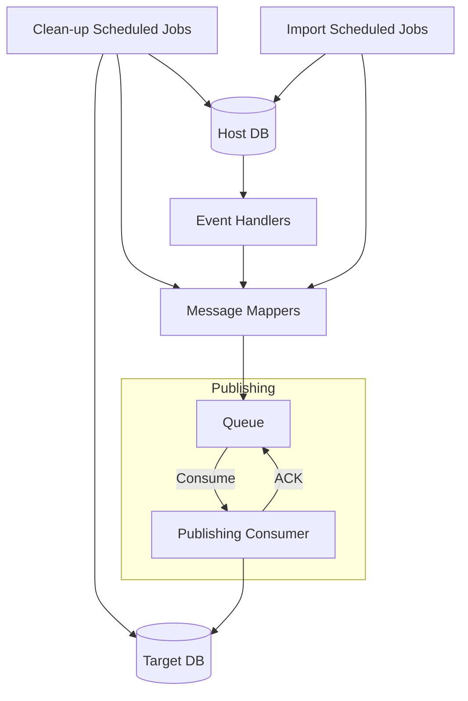

# Fides
A synchronization system to reliably transfer data between two separate data storage services.

## Use case and requirements
- Two separate service that store different data structures
- Both services provide an API to QUERY, CREATE, UPDATE, DELETE data
- Host storage sends events such as: CREATE, UPDATE, DELETE
- Data being transfered in batches
- Data availability during transfer
- Data Consistency
- Data mapping is a long-running process
- Timestamp which indicates data change is not available
- Transfer only data that changed to decrease batch size during import
- Handle network timeouts
- System monitoring

## Ideas
- Scheduled jobs
    - Transfer changed data records
    - Clean-up target service from non-existing data records
- Full reimport mechanism
- Events handling
    - Data sync when event occurs
- Each connection is protected by retry policy
- Circut breaking when the target service is unavailable
- Queue-Based Load Leveling
- Telemetry

## Workflow overview


## Tech stack
- [.NET](https://dotnet.microsoft.com/en-us/download)
- [NServiceBus](https://particular.net/nservicebus)
- [Polly](https://github.com/App-vNext/Polly)
- [NLog](https://nlog-project.org)
- [Docker](https://www.docker.com)
- [MS SQL](https://hub.docker.com/_/microsoft-mssql-server)
- [Redis](https://redis.com)
- [Azure Functions](https://docs.microsoft.com/en-us/azure/azure-functions/)
- [Azure Cosmos DB](https://docs.microsoft.com/en-us/azure/cosmos-db/)
- [RabbitMQ](https://www.rabbitmq.com)
- [ELK](https://www.elastic.co/what-is/elk-stack)

## How to run
Run `setup.sh` to create `.env`:
```
sh setup.sh
```

Create containers:
```
docker compose up
```

## References
- [Scheduler Agent Supervisor](https://docs.microsoft.com/en-us/azure/architecture/patterns/scheduler-agent-supervisor)
- [Data Consistency Primer](https://docs.microsoft.com/en-us/previous-versions/msp-n-p/dn589800(v=pandp.10))
- [Queue-Based Load Leveling](https://docs.microsoft.com/en-us/azure/architecture/patterns/queue-based-load-leveling)
- [Retry](https://docs.microsoft.com/en-us/azure/architecture/patterns/retry)
- [Circuit Breaker](https://docs.microsoft.com/en-us/azure/architecture/patterns/circuit-breaker)
- [Rate Limiting](https://docs.microsoft.com/en-us/azure/architecture/patterns/rate-limiting-pattern)
- [Priority Queue](https://docs.microsoft.com/en-us/azure/architecture/patterns/priority-queue)
