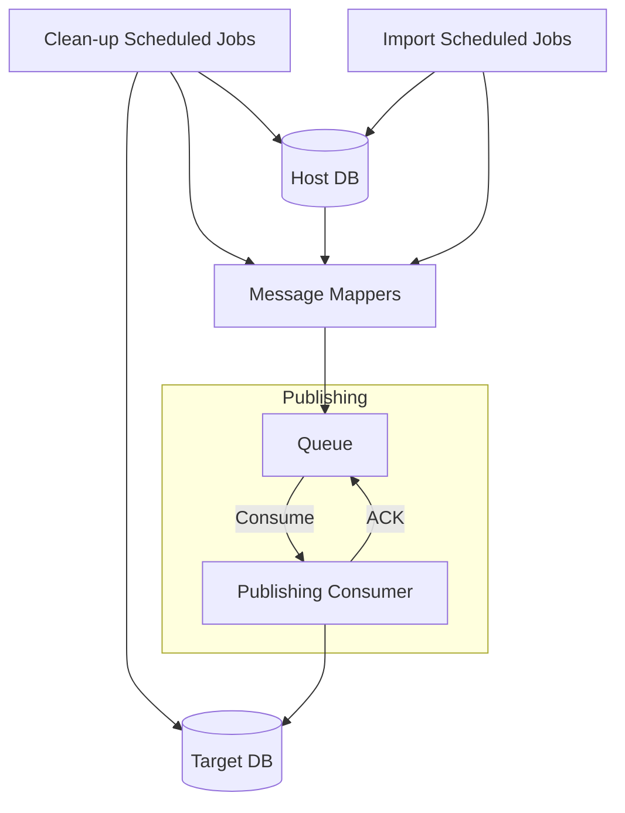

# Fides

[](https://dev.azure.com/djacho11/Fides/_build/latest?definitionId=2&branchName=master)

A synchronization system to reliably transfer data between two separate data storage services.

## Use case and requirements
- Two separate service that store different data structures
- Both services provide an API to QUERY, CREATE, UPDATE, DELETE data
- Data being transfered in batches
- Data availability during transfer
- Data Consistency
- Data mapping is a long-running process
- Timestamp which indicates data change is not available
- Transfer only data that changed to decrease batch size during import
- Handle network timeouts
- System monitoring

## Ideas
- Scheduled jobs
    - Transfer changed data records
    - Clean-up target service from non-existing data records
- Each connection is protected by retry policy
- Circut breaking when the target service is unavailable
- Queue-Based Load Leveling
- Telemetry

## Workflow overview


## Local development
To setup local environment go to `./infrastructure/local/` directory and:
```
docker compose up
```

It will create and run the following services:
- SQL
    - `http://localhost:1435`
- RabbitMQ
    - `http://localhost:15672` - Management UI
    - `http://localhost:5672`
- Elasticsearch
    - `http://localhost:9200`
    - `http://localhost:9300`
- Logstash
    - `http://localhost:5044`
    - TCP: `http://localhost:5001`
    - UDP: `http://localhost:5000`
    - `http://localhost:9600`
- Kibana
    - `http://localhost:5601`
- SQLPad
    - `http://localhost:3000`

Local secrets are stored inside `./infrastructure/local/.env`.

If you change content of the `.env` file the following files also has to be changed:
- `./src/SyncConsumers/appsettings.Development.json`
- `./src/SyncFunction/appsettings.Development.json`

## Azure Key Vault configuration
Set the following secrets:

### ARM templates
- RegistryUsername
- RegistryPassword
- ElasticSearchPassword
- KibanaPassword
- LogstashPassword
- SAPassword

### Dashboard
#### Connection strings: 
- SyncOrchestratorHttpStartUrl
#### Application settings:
- AzureAd--Domain
- AzureAd--ClientId
- AzureAd--TenantId

### Sync Functions and Consumers
#### Connection strings:
- StoresDbContext
- KeyVaultUri
#### Application settings:
- RabbitMqOptions--Host
- RabbitMqOptions--UserName
- RabbitMqOptions--Password
- ELKOptions--ElasticSearchUri

## Tech stack
- [.NET](https://dotnet.microsoft.com/en-us/download)
- [MassTransit](https://masstransit-project.com)
- [Polly](https://github.com/App-vNext/Polly)
- [NLog](https://nlog-project.org)
- [Docker](https://www.docker.com)
- [MS SQL](https://hub.docker.com/_/microsoft-mssql-server)
- [Azure Functions](https://docs.microsoft.com/en-us/azure/azure-functions/)
- [Azure Key Vault](https://docs.microsoft.com/en-us/azure/key-vault/general/basic-concepts)
- [Microsoft identity platform](https://docs.microsoft.com/en-us/azure/active-directory/develop/v2-overview)
- [RabbitMQ](https://www.rabbitmq.com)
- [ELK](https://www.elastic.co/what-is/elk-stack)

## References
- [Scheduler Agent Supervisor](https://docs.microsoft.com/en-us/azure/architecture/patterns/scheduler-agent-supervisor)
- [Data Consistency Primer](https://docs.microsoft.com/en-us/previous-versions/msp-n-p/dn589800(v=pandp.10))
- [Queue-Based Load Leveling](https://docs.microsoft.com/en-us/azure/architecture/patterns/queue-based-load-leveling)
- [Retry](https://docs.microsoft.com/en-us/azure/architecture/patterns/retry)
- [Circuit Breaker](https://docs.microsoft.com/en-us/azure/architecture/patterns/circuit-breaker)
- [Rate Limiting](https://docs.microsoft.com/en-us/azure/architecture/patterns/rate-limiting-pattern)
- [Priority Queue](https://docs.microsoft.com/en-us/azure/architecture/patterns/priority-queue)
