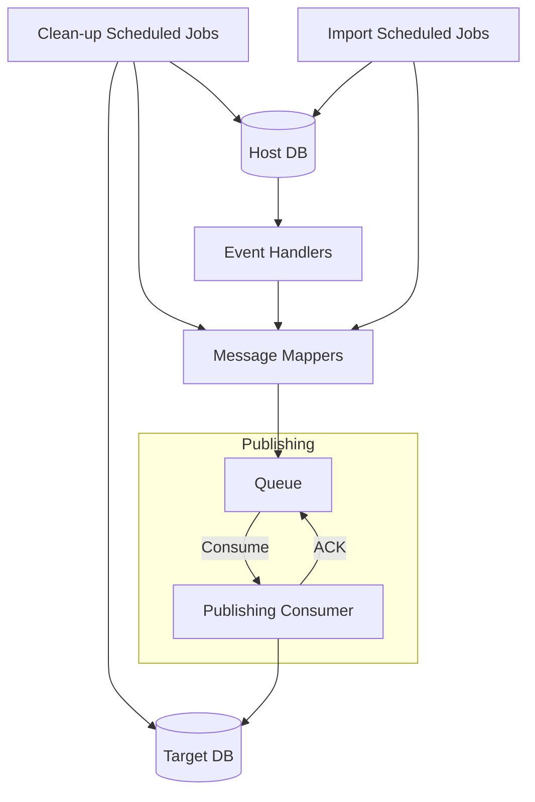

```mermaid
    flowchart TD;
        HostDB[(Host DB)]
        TargetDB[(Target DB)]
        ImportScheduledJobs[Import Scheduled Jobs]
        PublishingConsumer[Publishing Consumer]
        CleanUpScheduledJobs[Clean-up Scheduled Jobs]
        EventHandlers[Event Handlers]
        MessageMappers[Message Mappers]

        subgraph Publishing
            Queue -- Consume --> PublishingConsumer -- ACK --> Queue
        end

        CleanUpScheduledJobs --> HostDB
        CleanUpScheduledJobs --> TargetDB & MessageMappers

        HostDB --> EventHandlers
        EventHandlers & ImportScheduledJobs --> MessageMappers

        ImportScheduledJobs --> HostDB
        MessageMappers --> Queue
        
        PublishingConsumer --> TargetDB
```
